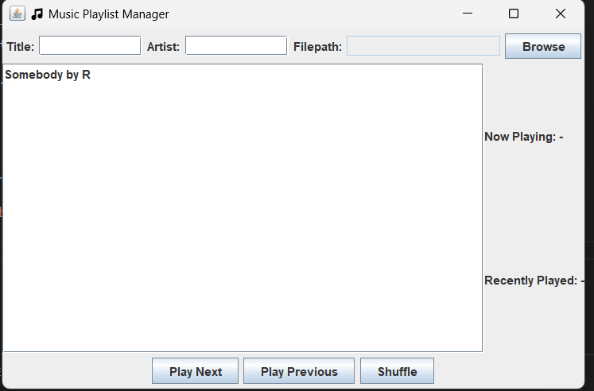

# MusicPlayList_Project

A Java Swing GUI-based application to manage and play MP3 songs.
You can add, shuffle, and play songs from your custom playlist — built using Java, Swing, and JLayer (jl1.0.1.jar).

## 📌 Features

- 🎧 Add songs with **title**, **artist**, and **file path**
- 📂 **Browse local .mp3 files** via file chooser
- ▶️ Play **Next** or **Previous** song
- 🔀 **Shuffle** the playlist randomly
- 🖥️ Built using **Java Swing GUI**
- 🎶 MP3 playback using **JLayer (`jl1.0.1.jar`)**

---

## 🛠️ Technologies Used

| Technology       | Purpose                      |
|------------------|-------------------------------|
| Java (JDK 8+)     | Core application logic         |
| Swing             | GUI creation                   |
| JLayer (jl1.0.1)  | MP3 audio playback             |

## 🚀 How to Run the Project


### ✅ Compile:
```bash
javac -cp "lib/jl1.0.1.jar" -d out src/*.java
java -cp "out;lib/jl1.0.1.jar" PlaylistGUI


## Interface Preview




##Keep Learning!!
